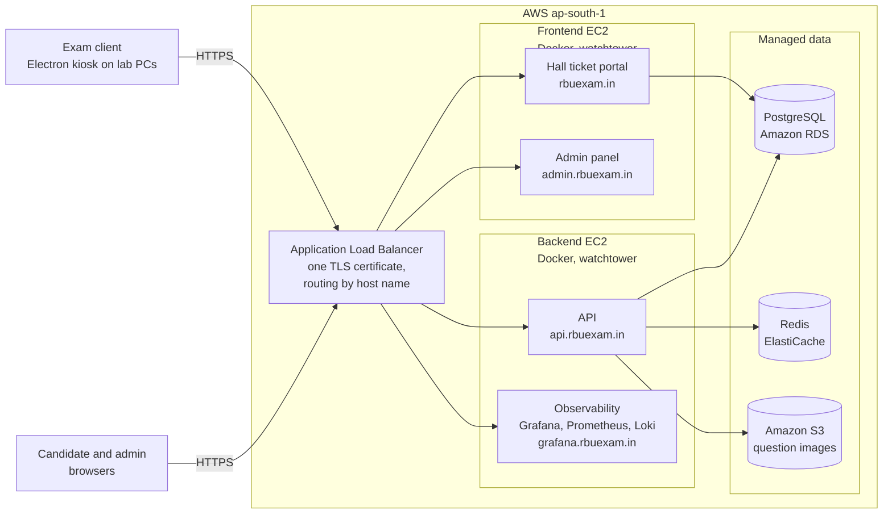
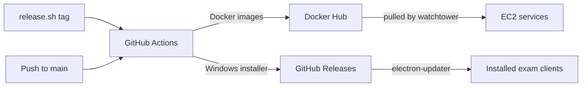

# WCL Examination Platform

Everything that powers the WCL examination at Ramdeobaba University:
a sealed desktop client candidates take the exam in, a live control room
for administrators, a hall ticket portal for the public, and one API
behind them all.

**[rbuexam.in](https://rbuexam.in)** &nbsp;|&nbsp; **[admin.rbuexam.in](https://admin.rbuexam.in)** &nbsp;|&nbsp; **[api.rbuexam.in](https://api.rbuexam.in/health)**

## What this is

This repository is the complete software stack used to conduct the
Western Coalfields Limited (WCL) examination hosted at Ramdeobaba
University (RBU), Nagpur. Hundreds of candidates sit the exam at the
same time on lab computers, and the platform covers their entire
journey: downloading a hall ticket at home, taking a proctored exam in
a locked-down fullscreen application, and receiving their score the
moment the paper is submitted.

## The four applications

| App | Role |
|---|---|
| [`app/client`](../app/client) | Electron desktop app the candidates take the exam in. Fullscreen kiosk with no title bar and no way out, question images with zoom, offline-tolerant answer saving, and integrity monitoring. Updates itself between releases. |
| [`app/admin`](../app/admin) | Next.js control room: manage questions and their images, import participants, watch live sessions, add time, release device bindings, and export results. |
| [`app/hallticket`](../app/hallticket) | Next.js public portal where candidates fetch and print their hall ticket PDF before exam day. |
| [`app/api`](../app/api) | Bun + Express + Drizzle API that owns authentication, exam sessions, answer sync, grading, and feedback. PostgreSQL stores the truth, Redis holds the hot exam state. |

## How exam day works

1. **Before the exam.** The candidate opens [rbuexam.in](https://rbuexam.in), enters their employee id and date of birth, and downloads a hall ticket PDF with their seat allocation.
2. **Sitting down.** The lab PC launches the exam client straight into fullscreen kiosk mode. The candidate signs in with their assigned credentials and the session binds to that machine, so nobody else can continue it elsewhere.
3. **During the exam.** The timer runs on the server, so refreshes, crashes, and reboots cannot add time. Every answer is buffered locally and synced continuously, so nothing is lost if a machine dies mid-click. Leaving fullscreen, switching windows, or losing focus is recorded as an integrity event that proctors see live.
4. **If a PC fails.** A proctor presses Release device in the admin panel, the candidate logs in on any other machine, and every answer, every mark for review, and the running clock resume exactly where they left off.
5. **Submitting.** Grading happens instantly on the server, with negative marking of 0.5 per wrong answer. The candidate sees their final score, rates the platform and the venue, and the application closes itself, leaving the seat ready for the next candidate.
6. **The deadline.** Anyone still writing at the deadline is auto-submitted by the server, even if their machine is powered off.

## Architecture

The infrastructure is codified as Terraform in [`terraform/`](../terraform),
and the full network design (VPC, security groups, data flows) is explained
in [docs/ARCHITECTURE.md](../docs/ARCHITECTURE.md).

Server deploys are cut deliberately with `./release.sh <service>`, which
tags a version; the exam client ships on every push to main:

## Tech stack

Bun, TypeScript, Express, Drizzle ORM, PostgreSQL, Redis, Next.js, React,
Tailwind CSS, shadcn/ui, Electron, electron-vite, Docker, GitHub Actions,
Terraform, Grafana, Prometheus, Loki,
and AWS (EC2, ALB, RDS, ElastiCache, S3, Route 53, ACM).

## Running it locally

Prerequisites: [Bun](https://bun.sh) plus PostgreSQL and Redis (Docker
works well for both).

| App | Start | Serves |
|---|---|---|
| API | `cd app/api && bun install && bun run db:migrate && bun run seed && bun run dev` | http://localhost:4000 |
| Admin | `cd app/admin && bun install && bun run dev` | http://localhost:5000 |
| Hall ticket | `cd app/hallticket && bun install && bun run dev` | http://localhost:5001 |
| Client | `cd app/client && bun install && bun run dev` | desktop window |

Each app ships a `.env.example` describing its configuration and a README
with the details. Everything defaults to the local API at port 4000.

## Production

| URL | Service |
|---|---|
| https://rbuexam.in | Hall ticket portal |
| https://admin.rbuexam.in | Admin panel |
| https://api.rbuexam.in | API |
| https://grafana.rbuexam.in | Grafana dashboards (login required) |

## Documentation

| Document | Contents |
|---|---|
| [docs/API.md](../docs/API.md) | Full API reference |
| [docs/RUNBOOK.md](../docs/RUNBOOK.md) | Operations runbook for exam day |
| [docs/NEW_EXAM.md](../docs/NEW_EXAM.md) | Setting up a new exam from scratch |
| [docs/FEEDBACK.md](../docs/FEEDBACK.md) | Post-submission candidate feedback |
| [docs/KIOSK_LOCKDOWN.md](../docs/KIOSK_LOCKDOWN.md) | How the client lockdown works |
| [docs/ARCHITECTURE.md](../docs/ARCHITECTURE.md) | Network design, security groups, and data flows |
| [docs/DEPLOY_FRONTEND.md](../docs/DEPLOY_FRONTEND.md) | Frontend infrastructure and deployment |
| [docs/DEPLOY_BACKEND.md](../docs/DEPLOY_BACKEND.md) | Backend infrastructure and deployment |
| [docs/OBSERVABILITY.md](../docs/OBSERVABILITY.md) | Logs, metrics, and dashboards |
| [docs/RULES.md](../docs/RULES.md) | Writing rules for prose in this repository |

## Team

| | Role |
|---|---|
| [Bhuvnesh Verma](https://github.com/MasterBhuvnesh) | Owner and maintainer. Platform architecture, API, admin panel, hall ticket portal, exam client, and the AWS infrastructure and deployment pipeline. |
| [Vivian Demello](https://github.com/vynride) | Exam client. Auto-update pipeline, release tooling, and the one-line installer. |

Code ownership per path is declared in
[.github/CODEOWNERS](CODEOWNERS), which GitHub uses to request the right
reviewer automatically on every pull request.
