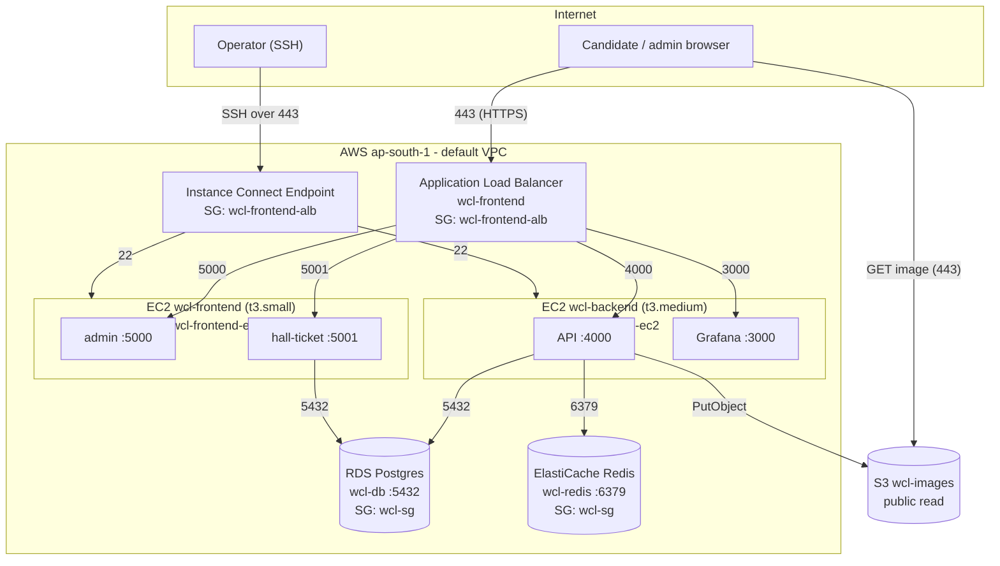

# Infrastructure architecture

How the WCL exam system is wired on AWS: the network, the security boundaries,
the load balancer, and the path a request takes from a candidate's browser to
the database and back. Everything here is what the Terraform in `terraform/`
provisions, in region `ap-south-1` (Mumbai).

The design is deliberately small. One VPC, one load balancer, two application
instances, two managed data stores. Isolation is enforced by security groups
rather than private subnets, which keeps the topology flat and cheap while
still giving each tier only the access it needs.

## Topology at a glance

## Region and availability zones

Everything is in `ap-south-1`. AWS splits every region into isolated
availability zones (AZs). This account's default VPC has one subnet in each of
the three zones `ap-south-1a`, `1b`, and `1c`. The instances and data stores
each live in a single zone; the load balancer spans all three so it stays
reachable even if one zone has trouble.

## VPC and subnets

A VPC (Virtual Private Cloud) is a private, isolated slice of the AWS network
with its own IP range. Every resource here runs inside the account's **default
VPC** (`vpc-078309ac3e7f9271a`). Using the default VPC, rather than a
hand-built one, is a deliberate simplification: it already has an internet
gateway attached and a route table that sends `0.0.0.0/0` out through it, so
any instance in it can reach the internet and, given a public IP, be reached
from it.

A **subnet** is a range of IP addresses within the VPC, pinned to one AZ. The
default VPC has three, one per zone:

| Subnet | AZ | Role |
|---|---|---|
| `subnet-0dc831fafa6ea08bf` | ap-south-1a | Both EC2 instances, the Instance Connect Endpoint, an ALB node |
| `subnet-09d6cf38dfcaf75f9` | ap-south-1b | An ALB node |
| `subnet-02aa09d2a2254d88f` | ap-south-1c | An ALB node, part of the Redis subnet group |

All three are **public subnets**: their route table has a path to the internet
gateway. There are no private subnets in this design. That is the key trade-off
to understand: RDS and Redis are not hidden in a private subnet with no route
to the internet. They sit in public subnets, and what actually keeps them
private is their **security group**, which permits inbound traffic only from
the application instances. A request from the open internet to the database
never gets past the security group, so in practice it is closed, even though
the subnet itself is routable.

The load balancer requires at least two subnets in different AZs; it is given
all three so it can place a node in each.

## Security groups: the real firewall

A security group is a **stateful** virtual firewall attached to an elastic
network interface (an instance, the ALB, RDS, Redis). Stateful means you only
write the inbound rule: if traffic is allowed in, the reply is allowed back out
automatically, regardless of outbound rules. Rules can reference another
security group as the source instead of an IP range, which is how each tier is
told "accept traffic only from the tier in front of me" without hardcoding any
addresses.

There are four groups. Their inbound rules are the entire access-control story.

### wcl-frontend-alb (the public edge)

The only group open to the internet.

| Direction | Port | Source / Dest | Why |
|---|---|---|---|
| Inbound | 80 | `0.0.0.0/0` | Plain HTTP, only to redirect to HTTPS |
| Inbound | 443 | `0.0.0.0/0` | All real traffic (TLS) |
| Outbound | all | `0.0.0.0/0` | Reach the instances behind it and return responses |

This group is reused as the source group for the Instance Connect Endpoint, so
"from the ALB security group" also means "from the SSH endpoint" in the rules
below.

### wcl-frontend-ec2 (admin + hall-ticket instance)

| Direction | Port | Source | Why |
|---|---|---|---|
| Inbound | 5000 | wcl-frontend-alb | Admin panel, only from the ALB |
| Inbound | 5001 | wcl-frontend-alb | Hall-ticket portal, only from the ALB |
| Inbound | 22 | wcl-frontend-alb | SSH, only through the Instance Connect Endpoint |
| Outbound | all | `0.0.0.0/0` | Pull images, reach RDS, apt updates |

The app ports are never exposed to the internet directly. The only way to reach
port 5000 or 5001 is through the load balancer, which means the only way in is
HTTPS on a known hostname.

### wcl-backend-ec2 (API + Grafana instance)

| Direction | Port | Source | Why |
|---|---|---|---|
| Inbound | 4000 | wcl-frontend-alb | API, only from the ALB |
| Inbound | 3000 | wcl-frontend-alb | Grafana, only from the ALB |
| Inbound | 22 | wcl-frontend-alb | SSH via the Instance Connect Endpoint |
| Outbound | all | `0.0.0.0/0` | Reach RDS, Redis, S3, Docker Hub |

### wcl-sg (RDS + Redis)

The most restrictive group. It admits nothing from the internet.

| Direction | Port | Source | Why |
|---|---|---|---|
| Inbound | 5432 | wcl-backend-ec2, wcl-frontend-ec2 | Postgres, from the API and the hall-ticket portal only |
| Inbound | 6379 | wcl-backend-ec2 | Redis, from the API only |
| Outbound | all | `0.0.0.0/0` | Return traffic (stateful); no outbound is initiated |

Because the source is a security group, not a CIDR, the database automatically
accepts the app instances no matter what private IP they get, and rejects
everything else, including anything else in the same subnet.

### Why outbound is open everywhere

Every group allows all outbound traffic. The instances genuinely need it: they
pull container images from Docker Hub, watchtower polls Docker Hub every minute,
the API writes to S3 and talks to RDS and Redis, and `apt` fetches security
updates. Locking egress down would mean enumerating every one of those
destinations for little gain on a stack this size. The inbound rules are where
the security lives.

## The load balancer

The Application Load Balancer (`wcl-frontend`) is the single public entry point
for the whole system. It does four jobs.

**1. Terminates TLS.** It holds the ACM wildcard certificate for `rbuexam.in`
and `*.rbuexam.in` and decrypts HTTPS at the edge. Traffic from the ALB to the
instances is plain HTTP inside the VPC, so the app containers never deal with
certificates. One certificate covers every current and future subdomain.

**2. Redirects HTTP to HTTPS.** The port 80 listener does nothing but issue a
301 to the `https://` form, so no traffic is ever served in the clear.

**3. Routes by hostname.** The port 443 listener inspects the `Host` header and
forwards to a **target group** by rule. A target group is a named set of
instance-plus-port endpoints with a health check.

| Hostname | Listener rule | Target group | Instance : port |
|---|---|---|---|
| `rbuexam.in` | default action | wcl-hallticket | frontend : 5001 |
| `admin.rbuexam.in` | priority 10 | wcl-admin | frontend : 5000 |
| `api.rbuexam.in` | priority 20 | wcl-api | backend : 4000 |
| `grafana.rbuexam.in` | priority 30 | wcl-grafana | backend : 3000 |

Rules are evaluated by priority, lowest first; anything that matches no rule
falls through to the default (the hall-ticket portal). This is why four
hostnames on one IP can serve four different applications.

**4. Health-checks the targets.** Each target group polls its instances
(`/health` for the API, `/api/health` for Grafana, the default `/` for the
others). The ALB only forwards to targets that pass, and it fails open during
the brief warm-up window after a container restarts.

DNS ties it together: `rbuexam.in` and each subdomain are Route53 **A-alias**
records pointing at the ALB. An alias record resolves to the ALB's current set
of IP addresses automatically, so nothing breaks when AWS rotates them.

## Data flows

### A candidate takes an exam

1. The browser resolves `api.rbuexam.in` through Route53 to an ALB IP.
2. It opens HTTPS on 443. The `wcl-frontend-alb` group admits 443 from the
   internet; the ALB terminates TLS.
3. The 443 listener sees `Host: api.rbuexam.in`, matches rule 20, and forwards
   over HTTP to the `wcl-api` target group, that is, the backend instance on
   port 4000. The `wcl-backend-ec2` group admits 4000 only from the ALB group,
   so this succeeds while a direct hit on the instance would not.
4. The API validates the login. It queries Postgres on 5432 and reads or writes
   session state in Redis on 6379. Both are allowed because `wcl-sg` lists the
   backend instance's security group as the source; the rate limiter and
   sessions live in Redis, exam data in Postgres.
5. The response returns to the browser through the ALB. Security groups are
   stateful, so no return rules are needed.
6. Question **images** do not go through the ALB at all. The browser fetches
   them straight from the public `wcl-images` S3 bucket over HTTPS, which keeps
   image bandwidth off the instance and the load balancer.

### An admin uses the panel

1. `admin.rbuexam.in` resolves to the same ALB.
2. Rule 10 forwards to `wcl-admin`, the frontend instance on 5000.
3. The admin panel is a browser app. Its API calls go back out to
   `api.rbuexam.in`, so they re-enter through the ALB and follow the API flow
   above. The panel instance itself does not talk to the API over the private
   network; it hands the browser a public API URL baked in at build time.

### A candidate downloads a hall ticket

1. `rbuexam.in` (the apex) resolves to the ALB.
2. No host rule matches the bare apex, so the listener's default action
   forwards to `wcl-hallticket`, the frontend instance on 5001.
3. The hall-ticket portal reads directly from Postgres (its `DATABASE_URL`),
   which is why `wcl-sg` admits 5432 from the frontend security group as well
   as the backend one.

### An operator connects for maintenance

1. There is no public port 22 anywhere. SSH goes through the **EC2 Instance
   Connect Endpoint**, which provides SSH over 443 from networks that block
   port 22, and pushes a short-lived key to the instance.
2. The operator opens a tunnel (`aws ec2-instance-connect open-tunnel ...`) to
   a local port, then SSHes to `127.0.0.1`.
3. The endpoint sits in the VPC using the `wcl-frontend-alb` security group.
   The instance security groups admit port 22 from that same group, so the
   endpoint can reach 22 while the internet cannot.

### Grafana

`grafana.rbuexam.in` follows the same edge path as the API (rule 30, backend
instance on 3000). Grafana's own login guards the UI; the observability stack
that feeds it (Prometheus, Loki, Alloy) runs container-to-container on the
backend instance and is never exposed. See `docs/OBSERVABILITY.md`.

## Why two instances

The API is separated from the admin and hall-ticket apps so that a load spike
or a restart on one does not disturb the other. During an exam the API is the
hot path (every answer save, heartbeat, and integrity post), so it gets the
larger `t3.medium`; the frontend apps are light and share a `t3.small`. Both
tiers scale and deploy independently, and a bad frontend release cannot take
the exam API down with it.

## Managed data stores

- **RDS Postgres (`wcl-db`)** holds all exam data: participants, questions,
  sessions, results, audit logs. Running it as a managed service means AWS
  handles backups (7 day retention), patching, and failover, rather than a
  Postgres process on the instance that would vanish if the box did.
- **ElastiCache Redis (`wcl-redis`)** holds ephemeral state: the per-candidate
  rate limiter buckets and short-lived session data. It is fast and
  disposable; losing it would not lose exam results.

Neither is reachable from the internet, only from the app instances through
`wcl-sg`. For local debugging they are reached through the same Instance
Connect SSH tunnel used for maintenance.

## S3

The `wcl-images` bucket serves question images with public read. Images are not
secret (a candidate sees them during the exam anyway), and serving them
directly from S3 keeps large static files off the instance and the load
balancer. The API is the only writer, using a dedicated IAM user
(`wcl-api-uploader`) whose single permission is `s3:PutObject` on this bucket,
so a leak of those credentials cannot read, delete, or touch anything else.

## What is not here, and why

- **No private subnets or NAT gateway.** Security groups already close the data
  tier, and a NAT gateway adds cost for no benefit at this scale.
- **No autoscaling groups.** Traffic is a known, scheduled exam window on fixed
  instances, not unpredictable public load.
- **No CloudFront.** S3 serves images directly and the audience is regional;
  a CDN would add moving parts without a measurable win today.

Each of these is a reasonable next step if the system grows; none is worth the
complexity now. The full resource inventory with identifiers is in
`docs/AWSCLI.md`, and the Terraform that builds all of it is in `terraform/`.
