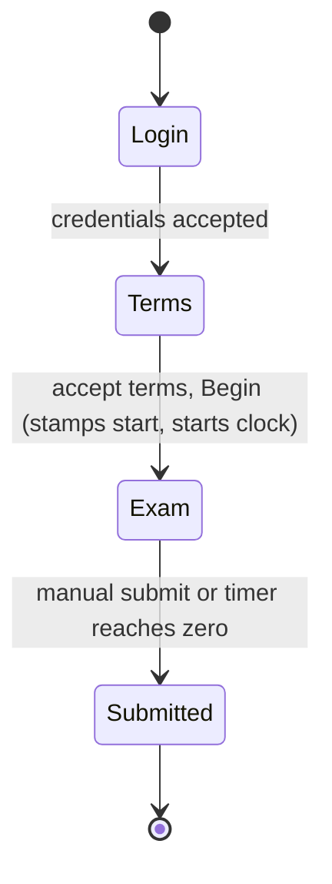

# WCL Implementation Status (Phase 1: Client + Development Backend)

This document records what has actually been built so far. It complements the
design in [EXAM_SYSTEM_PLAN.md](EXAM_SYSTEM_PLAN.md) and the task list in
[BUILD_CHECKLIST.md](BUILD_CHECKLIST.md). It reflects the state at commit
`283dccf`.

**Scope of this phase:** a fully working Electron exam client, plus a simple
in-memory backend that exists only to support the client during local
development. Production backend concerns (database, Redis, hashing, JWT,
WebSocket, rate limiting, TLS) are deliberately deferred.

---

## 1. Repository layout

```
app/
  client/        Electron exam client (electron-vite, React 19, TS, Tailwind v4, shadcn, lucide)
  api/           Simple in-memory backend (Bun + Express)
docs/            Plan, checklist, rules, and this status document
```

---

## 2. How to run locally

Two processes. The client expects the backend at `http://localhost:4000`
(override with `VITE_API_BASE`).

```
# Terminal 1 - backend
cd app/api
bun run dev            # http://localhost:4000 (auto-reload)

# Terminal 2 - client
cd app/client
npm run dev            # launches the fullscreen Electron app
```

**Development credentials:** any non-empty username with password `password`.
The Exam ID / Engine field is optional and defaults to the seeded exam
`WCL-DEMO`.

**Developer override:** `Ctrl+Shift+Alt+X` toggles Developer Mode, which disables the
kiosk lock, allows minimizing and app switching, and opens DevTools. This is the
intended escape hatch while testing.

---

## 3. Candidate flow



1. **Login** (`pages/LoginPage.tsx`): username, password, optional Exam ID.
2. **Terms / lobby** (`pages/TermsPage.tsx`): exam metadata, server-authored
   instructions, standard terms, an explicit acceptance checkbox, and Begin.
3. **Exam** (`pages/ExamPage.tsx`): one-hour timer, central question, right-hand
   palette, navigation, submit.
4. **Submitted** (`pages/SubmittedPage.tsx`): calm confirmation. No score shown.

Routing lives in `App.tsx` with guards so a stage is only reachable in the
correct state; the guards also auto-redirect when state changes (for example,
auto-submit moves the candidate to the Submitted screen).

---

## 4. Client architecture

### 4.1 Shared foundation (renderer)
- `lib/config.ts`: API base URL and timing constants (heartbeat interval,
  per-change push debounce).
- `types/exam.ts`: the client-side mirror of the API contract.
- `lib/api.ts`: a thin typed `fetch` client with a bearer token and an
  `ApiError` type; transport concerns only.
- `lib/buffer.ts`: the local write-buffer. Currently backed by `localStorage`
  behind a narrow interface so it can be swapped for `better-sqlite3` later
  without touching callers.
- `context/ExamProvider.tsx`: the single source of state and side effects.
- `styles/globals.css`: Inter font (bundled locally) plus the full shadcn theme
  tokens (light and dark) and global scrollbar hiding.

### 4.2 ExamProvider (the backbone)
`context/ExamProvider.tsx` exposes `useExam()` and owns:
- **Auth and session:** `login`, token, exam metadata, session status.
- **Begin:** calls `/exam/begin`, loads the manifest, starts the loops, and
  asserts the kiosk lock.
- **Timing:** stores the absolute deadline plus an estimated client-server clock
  offset and derives `remainingSeconds` each second. Every heartbeat reconciles
  the offset and deadline against the server. Reaching zero triggers
  auto-submit. The server remains authoritative.
- **Answer state:** `selectOption` (SCQ replace, MCQ toggle),
  `toggleMarkForReview`, `clearResponse`, and visited-tracking. Each change is
  stamped with a monotonic `client_seq`, persisted to the buffer, and scheduled
  for sync.
- **Two-tier sync:** a debounced per-change push plus a periodic heartbeat, both
  via `/exam/heartbeat`. Acknowledged answers are marked synced. Network errors
  flip an offline indicator and are retried on the next heartbeat.
- **Resume:** on launch, if a buffered session exists, calls `/exam/resume` and
  restores manifest, answers, deadline, and status (same-device recovery). A
  stale or expired session falls back to a clean login.
- **Bridge integration:** subscribes to developer-mode changes and integrity
  warnings, reports renderer-side integrity signals, and toggles the exam lock.

### 4.3 Screens and components
- `pages/LoginPage.tsx`, `pages/TermsPage.tsx`, `pages/ExamPage.tsx`,
  `pages/SubmittedPage.tsx`.
- `components/exam/`: `ExamHeader`, `ExamTimer`, `QuestionView`,
  `QuestionPalette`, `SubmitDialog`.
- `components/TitleBar.tsx`: frameless drag region; window controls are hidden
  during an active exam unless Developer Mode is on.
- `components/DevModeBadge.tsx`: persistent indicator while Developer Mode is on.
- `components/IntegrityOverlay.tsx`: blocking on-screen warning on integrity
  events (warn and log; no auto-submit or disqualification).

**Question palette states and colors:** not visited (neutral outline), not
answered (red), answered (green), marked for review (purple), answered and
marked (purple with a green dot). The current question is ring-highlighted. A
legend and live counts sit alongside the grid.

### 4.4 Electron main and preload (lockdown)
- `src/main/index.ts`, `src/main/lockdown.ts`, `src/main/devmode.ts`.
- Launches fullscreen; removes the native menu; preserves single-instance lock,
  the `wcl` deep link, the window-control IPC, and the deny-new-windows handler.
- **Strict enforcement** is active only when the exam is locked and Developer
  Mode is off: holds kiosk and fullscreen, re-enters fullscreen on
  leave/minimize, refocuses on blur and raises an integrity warning, and ignores
  window-control IPC.
- **Shortcut blocking** (best effort, while strict): swallows reload, DevTools,
  zoom, close, minimize, and quit shortcuts via `globalShortcut` and
  `before-input-event`.
- **Copy protection:** text selection is disabled in CSS (login inputs stay
  selectable), and the renderer blocks copy, cut, the context menu, and drag.
  Both relax in Developer Mode.
- **`Ctrl+Shift+Alt+X`** toggles Developer Mode via a best-effort global shortcut
  plus a reliable in-window fallback.
- **Renderer bridge** (`src/preload/index.d.ts` declares the type; the renderer
  reads it via `tsconfig.web.json`):
  ```ts
  interface ExamBridge {
    getDevMode(): Promise<boolean>
    onDevModeChanged(cb: (enabled: boolean) => void): () => void
    reportIntegrity(event: { type: string; meta?: Record<string, unknown> }): void
    onIntegrityWarning(cb: (info: { type: string; message: string }) => void): () => void
    setExamLock(locked: boolean): void
  }
  ```

---

## 5. Backend (development only)

Location `app/api`. Bun + Express, fully in-memory (no database, Redis, or
Docker). Opaque bearer tokens (`crypto.randomUUID`) mapped to in-memory
sessions. CORS open for all origins. Port 4000.

Files: `src/index.ts` (app and routes), `src/store.ts` (in-memory state and exam
metadata), `src/data/questions.ts` (an 80-question bank: 60 single-correct, 20
multiple-correct; `isCorrect` is server-only), `src/lib/shuffle.ts` (seeded
deterministic shuffle and subset selection), `src/lib/grading.ts`
(all-or-nothing grading), `src/lib/manifest.ts` (seed-ordered, `isCorrect`-
stripped client manifest).

Exam defaults: duration 3600 seconds, 60 questions served from the bank.

### API endpoints (as implemented)
| Method | Path | Purpose |
|---|---|---|
| GET | `/health` | Liveness. |
| POST | `/auth/login` | `{ username, password, examId? }` -> token, sessionId, exam meta, status. |
| POST | `/exam/begin` | Stamps start and deadline, allocates the seed, freezes the 60-question subset. Idempotent. |
| GET | `/exam/manifest` | Seed-ordered questions without `isCorrect`. 409 before Begin. |
| GET | `/time` | Server time for offset estimation. |
| POST | `/exam/answer` | Idempotent upsert with the monotonic `client_seq` guard. |
| POST | `/exam/heartbeat` | Accepts buffered answers; returns remaining, serverTime, acked, deadline, status. |
| POST | `/exam/submit` | Finalizes and grades; returns confirmation only, never the score. |
| POST | `/exam/resume` | Server-authoritative state for same-device recovery. |

All exam endpoints require `Authorization: Bearer <token>`. Deadline is enforced
by `answeredAt` plus a short grace, so before-deadline answers buffered during a
blip still sync.

---

## 6. Verification performed

- Client typecheck (node and web projects) passes.
- Client production build (`electron-vite build`) succeeds; the Inter font is
  bundled.
- Backend smoke test passes: login, begin, a 60-question manifest with no
  `isCorrect`, answer with the stale-write guard, heartbeat, submit, and resume.

The fullscreen GUI was not launched from the build environment (it could trap an
interactive session); visual confirmation should be done by running
`npm run dev`.

---

## 7. Known limitations and simplifications

1. **Alt+Tab and the Windows key are not fully blocked.** This is not possible
   from pure Electron on Windows. Closing the gap requires a native low-level
   keyboard hook (WH_KEYBOARD_LL in a native addon) or Windows Assigned Access /
   Shell Launcher kiosk policy.
2. **Local buffer uses `localStorage`, not `better-sqlite3`** yet. The interface
   in `lib/buffer.ts` isolates this so the swap is contained.
3. **Backend is in-memory and dev-grade:** plain password check (not hashed),
   opaque tokens (not JWT, not device-bound), no persistence, no Redis, no rate
   limiting, no WebSocket. State is lost on restart.
4. **Reconnect uses fixed-interval retry**, not exponential backoff.
5. **Different-device resume / device fingerprinting** is not implemented;
   same-device resume works.
6. **Server-side auto-submit jitter** and the availability-window hard close are
   not implemented in the dev backend.

---

## 8. Suggested next steps

- Replace `localStorage` with a `better-sqlite3` write-buffer behind the existing
  interface.
- Harden the backend toward the plan: PostgreSQL schema and migrations, hashed
  secrets, JWT with device binding, Redis, validation, rate limiting, and
  structured logging.
- Evaluate a native keyboard hook or Assigned Access for full kiosk lockdown.
- Build the admin frontend and endpoints (leaderboard, score edit, reset, add
  time, open/close, publish results, integrity-event review).
