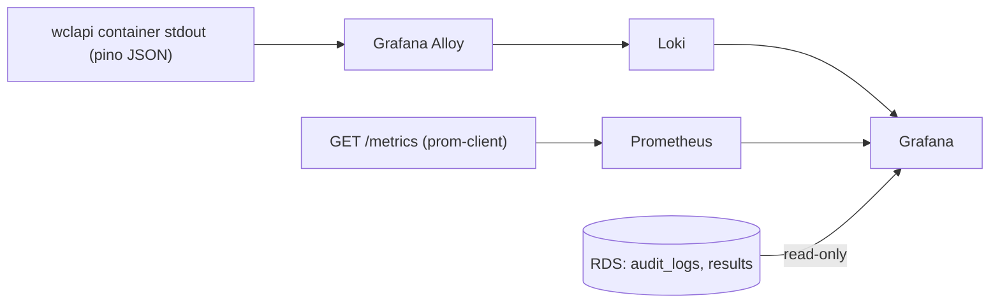

# Observability and monitoring (API)

Design for adding logs, metrics, and dashboards to the production API using
Loki, Prometheus, and Grafana, all running on the backend EC2 instance next
to the API container. Nothing here changes the exam client or any existing
API route: every addition is a new endpoint, a pass-through middleware, or a
new container. Each rollout step is independently shippable and reversible.

Status: design only, not yet implemented.

## Goals

- Request logs searchable per participant and per admin in Grafana, live
  during an exam.
- RED metrics (rate, errors, duration) for every route, plus process and
  Redis health.
- Dashboards over exam data (submissions, scores, admin actions) without
  touching the API at all, via a read-only Grafana connection to RDS.

## Logging: keep pino, skip winston

The API already logs structured JSON to stdout in production through pino
(`app/api/src/logger.ts`, level from `LOG_LEVEL`). That output is exactly
what Loki ingests. Migrating to winston would add a dependency, touch every
file that imports the logger, and produce the same JSON at the end. Decision:
keep pino.

What is missing today is a per-request log line: the API only logs errors and
lifecycle events. One middleware (below) adds that.

## Architecture



Grafana Alloy is the log collector (Promtail is end of life). It tails the
Docker json-file logs of the api container and pushes them to Loki. Both run
as containers in the same compose file, so Prometheus reaches the API by its
container name on the compose network and nothing new is exposed publicly.

Alloy also doubles as the host and container metrics collector: it embeds
node_exporter (`prometheus.exporter.unix`) and cAdvisor
(`prometheus.exporter.cadvisor`) as built-in components, so no separate
node-exporter or cadvisor containers are needed. Prometheus scrapes those
targets through Alloy alongside the API's own /metrics.

## API changes (one small release)

All additions live in `app/api`; existing routes and responses are untouched.

1. Add the `prom-client` dependency.
2. Request middleware, registered after `express.json` in
   `app/api/src/index.ts` (line 83), before the routers. On `res` finish it:
   - observes `http_request_duration_seconds{method,route,status}` and
     increments `http_requests_total{method,route,status}`;
   - writes one pino info line: `{method, route, status, durationMs,
     participantId?, sessionId?, adminId?}`. The identity fields come from
     `req.participant` / `req.admin`, which the existing auth middleware has
     already set by the time the response finishes.
3. New `GET /metrics` beside `/health`, returning the prom-client registry
   (default process metrics enabled). The ALB forwards all paths to the API,
   so the route requires a static bearer token from a new `METRICS_TOKEN`
   env var (one optional line in `app/api/src/env.ts`, same zod pattern as
   `LOG_LEVEL`). Prometheus sends the token in its scrape config.
4. Recommended related fix: `app.set("trust proxy", true)`. Behind the ALB,
   `req.ip` is currently the load balancer address, which also means the
   Redis rate limiter keys every client into one bucket. Setting trust proxy
   restores the real client IP for both logs and rate limiting.

Cardinality rule: participant and admin identifiers appear only as log
fields in Loki. Prometheus labels stay at `method`, `route`, `status`;
per-user metric labels would blow up the time series count.

## User-specific observability

- Participant journey: because every request line carries `participantId`
  and `sessionId`, a Grafana dashboard with a participant variable shows one
  candidate's full timeline (login, begin, answer saves, submit, integrity
  posts) as it happens. Query shape:
  `{container="wclapi"} | json | participantId="..."`.
- Admin actions: Grafana gets a second datasource, a read-only Postgres user
  on RDS limited to `audit_logs` and `results`. Panels: recent admin actions,
  submissions over time, score distribution. This needs zero API work since
  the audit trail already exists in the database.

## Host and container metrics

Alloy's embedded exporters cover what standalone node_exporter and cAdvisor
would provide, with no extra containers:

- Host (node_exporter component): CPU, memory, disk usage and I/O, network
  traffic, load average, filesystem usage, uptime.
- Containers (cAdvisor component): per-container CPU and memory, restart
  counts, running containers. This is how the wclapi container's own
  resource use is watched during an exam.

The exporters need read-only visibility into the host, which is why the
alloy service below mounts the root filesystem, /sys, /proc, and the Docker
socket. Grafana dashboard IDs 1860 (Node Exporter Full) and 14282 (cAdvisor)
import directly against these metrics.

## Proposed docker-compose.backend.yml

Full file for review. The `api` and `watchtower` services are unchanged from
what runs today; the four new services and the volumes block are the
additions. Config files referenced here (`observability/alloy.config`,
`observability/prometheus.yml`, `observability/grafana-datasources.yml`)
are written at implementation time and copied to `/srv/wcl/observability/`
on the instance.

```yaml
# Backend EC2 stack: API + Watchtower + observability (Loki, Alloy,
# Prometheus, Grafana).
# TLS and the api.rbuexam.in hostname are handled by the shared AWS
# Application Load Balancer (target group wcl-api, port 4000).
#
# Usage:
#   cp .env.prod.backend.example .env.prod.backend
#   docker compose -f docker-compose.backend.yml up -d

services:
  api:
    image: ${DOCKERHUB_USER:-bhuvneshverma}/wclapi:latest
    container_name: wclapi
    restart: unless-stopped
    env_file:
      - .env.prod.backend
    ports:
      - "4000:4000"
    labels:
      - com.centurylinklabs.watchtower.enable=true

  watchtower:
    image: containrrr/watchtower:latest
    container_name: watchtower
    restart: unless-stopped
    volumes:
      - /var/run/docker.sock:/var/run/docker.sock
    environment:
      DOCKER_API_VERSION: "1.55"
    command:
      - --label-enable
      - --cleanup
      - --interval
      - "60" # Check every 1 minute

  loki:
    image: grafana/loki:3.4.2
    container_name: loki
    restart: unless-stopped
    command: -config.file=/etc/loki/local-config.yaml
    volumes:
      - loki-data:/loki
    # Single-binary mode with filesystem storage; retention is set to
    # 7 days in the config. No ports published: only Alloy and Grafana
    # reach it over the compose network.
    mem_limit: 512m

  alloy:
    image: grafana/alloy:v1.8.1
    container_name: alloy
    restart: unless-stopped
    command:
      - run
      - /etc/alloy/config.alloy
    volumes:
      - ./observability/alloy.config:/etc/alloy/config.alloy:ro
      - /var/lib/docker/containers:/var/lib/docker/containers:ro
      - /var/run/docker.sock:/var/run/docker.sock:ro
      # Host visibility for the embedded node_exporter and cAdvisor
      # components (host CPU, memory, disk, network, per-container usage).
      - /:/host/root:ro,rslave
      - /sys:/host/sys:ro
      - /proc:/host/proc:ro
    pid: host
    mem_limit: 256m

  prometheus:
    image: prom/prometheus:v3.3.0
    container_name: prometheus
    restart: unless-stopped
    command:
      - --config.file=/etc/prometheus/prometheus.yml
      - --storage.tsdb.retention.time=15d
    volumes:
      - ./observability/prometheus.yml:/etc/prometheus/prometheus.yml:ro
      - prometheus-data:/prometheus
    # Scrapes http://wclapi:4000/metrics (bearer METRICS_TOKEN) plus the
    # host and container metrics exposed by Alloy, every 15s. No ports
    # published.
    mem_limit: 512m

  grafana:
    image: grafana/grafana:11.6.1
    container_name: grafana
    restart: unless-stopped
    environment:
      GF_SECURITY_ADMIN_PASSWORD: ${GRAFANA_ADMIN_PASSWORD:?set in .env.prod.backend}
      GF_SERVER_ROOT_URL: http://localhost:3000
    volumes:
      - ./observability/grafana-datasources.yml:/etc/grafana/provisioning/datasources/datasources.yml:ro
      - grafana-data:/var/lib/grafana
    ports:
      - "127.0.0.1:3000:3000" # loopback only; reached via the SSH tunnel
    mem_limit: 256m

volumes:
  loki-data:
  prometheus-data:
  grafana-data:
```

Memory budget: the t3.medium has 4 GB. The API is light; the limits above
cap the stack at about 1.5 GB, leaving comfortable headroom. If memory
pressure appears, drop Prometheus retention first.

## Access

Grafana binds to loopback only, so it is reached through the existing
Instance Connect SSH tunnel (same pattern as `secret/README.md`) with a
local forward of port 3000, then http://localhost:3000. Exposing it publicly
as grafana.rbuexam.in through the ALB (new target group, Route53 record) is
a possible follow-up, not part of this design.

## Rollout order

1. Copy the observability config files and the updated compose file to
   `/srv/wcl` and run `docker compose -f docker-compose.backend.yml up -d`.
   Logs flow to Loki immediately with zero API changes.
2. Ship the API changes (middleware, /metrics, METRICS_TOKEN, trust proxy)
   with `./release.sh api`. Never cut this release during a live exam.
3. Confirm Prometheus targets are up, then build the Grafana dashboards
   (participant journey, RED overview, admin activity) and import the
   community host and container dashboards (1860, 14282).
4. Verify: `curl -H "Authorization: Bearer $METRICS_TOKEN"
   localhost:4000/metrics` on the instance; a Loki query for
   `{container="wclapi"}` returns request lines; dashboards render.

## Out of scope for now

- Alerting rules: add once dashboards prove out which signals matter.
- Tracing (OpenTelemetry): single service, little value until there are more
  moving parts.
- CloudWatch integration: the compose stack covers the need at zero AWS cost.
- Log-derived metrics in Loki: plain LogQL queries cover current questions.
